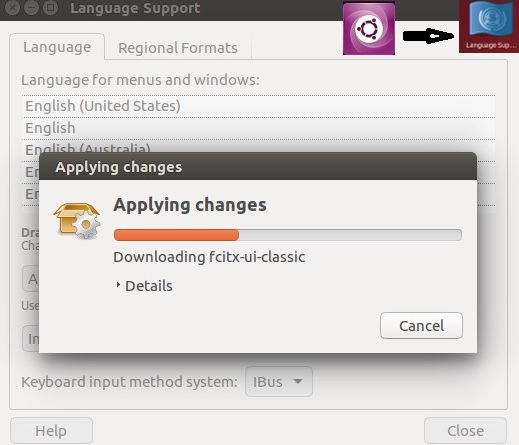
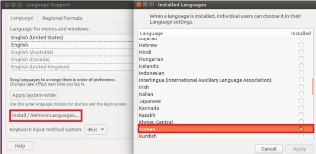
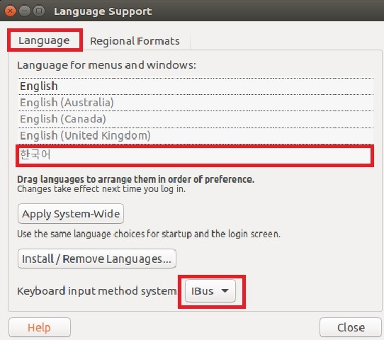
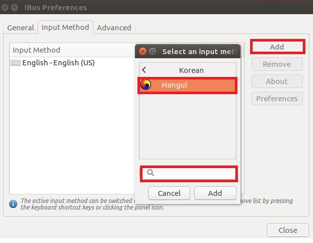
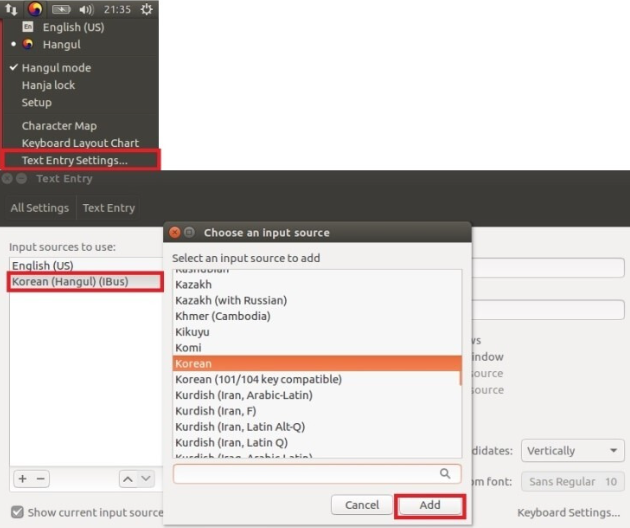
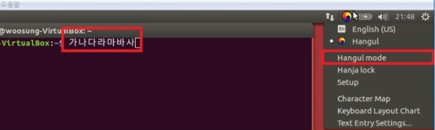

# 어떻게 문제에 접근하게 되었는가? 

우분투 OS를 설치하고나서 터미널에 명령어 테스트를 한다고 echo "테스트 입니다."; 를 입력했지만 문구가 깨져서 출력이 되었다. 

해당 문제를 해결하기 위해, 아래와 같은 방법으로 해결하게 되었다. 

우분투 안에는 다양한 언어팩을 지원한다. OS 설치 시 언어팩 설치를 놓쳤다면, 아래와 같이 추가적으로 설치를 해주어야한다.

# 우분투 한글설정 방법

## 메뉴의 언어팩 설치

## 메뉴의 언어팩 설정

